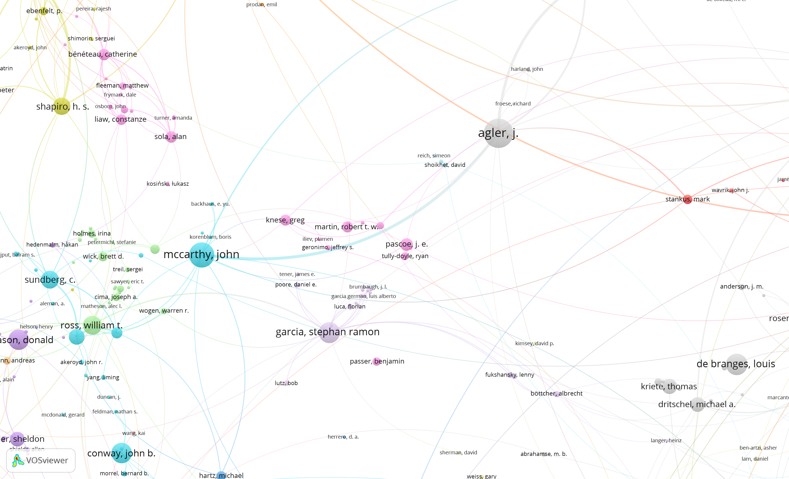

<image width="20%" align="left" src="assets/images/858448641.jpg"/> I am an assistant professor in the Department of Mathematics at Cal Poly, San Luis Obispo (where I also did my undergraduate degree). I work in operator theory (broadly construed), specifically in areas related to questions of complex analysis in one and several variables. Recent projects have involved dynamics of rational inner skew-products, concrete realization of analytic functions, and Lowner/Kraus type results in the setting of noncommutative analysis. 

I'm very interested in open source materials for upper division mathematics. I've been making interactive notes for the last couple of years - you can find my work in the projects tab. All of that work is posted on github and free for use and modification.

I'm also working on efforts to organize the larger operator theory community - the Operator Theory Information Network is located at [operatortheory.org][1]. 

[1]:<https://operatortheory.org>

